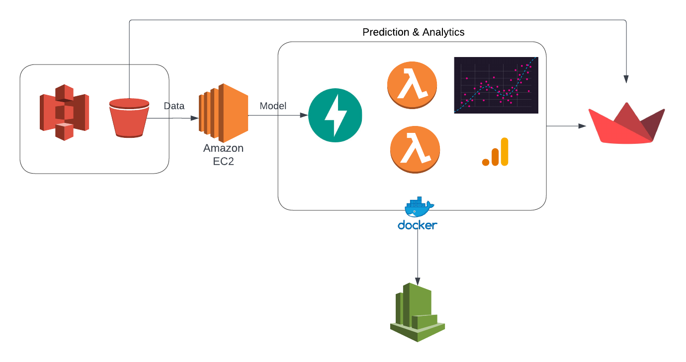

# BigDataFinalProject

  [](https://www.python.org/)

# Store Sales Data Analysis for Corporacion Favorita

This repository contains a serverless architecture for data analysis that is robust and can be scaled to incoroprate a multitude of users by using concurrency in lambda functions. This project uses the AWS architecture, mainly - Amazon S3, Amazon ECR and AWS Lambda functions.

**Team 6 - Members:**<br />
Akshata Nanjappa <br />
Akshay Bhosale <br />
Vachana Belgavi <br />

##### Streamlit Application<br />
[](http://shields.io/)

Quick access to the frontend web application built using Streamlit:
 (https://share.streamlit.io/akshatananjappa/salesforcaststreamlit/app.py)

## Architecture Diagram


### Codelabs document
https://codelabs-preview.appspot.com/?file_id=1M49JLASvF8Pfw_X8auKdtac0mHXgCW00HBbo3u1KCag#5

## Steps to Reproduce Architecture
### Roles
Create an AWS account and manage roles with IAM. The following roles are needed for the workflow of the architecture and github actions
* AmazonEC2ContainerRegistryFullAccess
* AWSLambdaBasicExecutionRole

AWS CLI or the console can be used to create the above roles

### Lambda Functions
All the Lambda functions shown in the architecture diagram have been deployed using SAM (Serverless Application model). Every Lambda function comes with it's own 
* store_sales.yml
* helper.py
* requirements.txt
* main.py

Create an S3 bucket that will store the Lambda function's metadata for deployment
* aws s3api create-bucket \
--<your_bucket> \
--region <pass_region> \
--create-bucket-configuration LocationConstraint=<pass_region>


These files can be found in the folders in this repo with the prefix **'lambda_'**. Go into the respective folder and follow these steps to deploy your Lambda function on AWS:
* sam validate 
> returns a success message if the template is valid
* sam build --use-container --debug
>Builds the entire package into an AWS like docker environment
* sam package --s3-bucket <your_bucket> --output-template-file out.yml --region <pass_region>
>Add the bucket name that you previously created along with the desired region
* sam deploy --template-file out.yml --stack-name <stack_name> --region <pass_region> --no-fail-on-empty-changeset --capabilities CAPABILITY_IAM  
> Enter a name for the stack, recommended name is the same as the **lambda_** folder names   

Go to AWS CloudFormation to check if your stack has been created.

### Other Resources
The template files create the following resources apart from the Lambda functions to support the workflow of the architecture. All the details about these resources are in the template files in the respective folders
* S3 Bucket 1
* S3 Bucket 2
* ECR
* API Gateway
* CloudWatch

### Deploying the Streamlit App 

[Streamlit](https://www.streamlit.io/) is used to show the end-users how the deployed lambda functions come together for the three main features of the project i.e. stream-processing and batch-processing. The app directly interacts with the built components on AWS and provides a userinterface to run the pipeline.

The Python code for this app can be found at `streamlit_webapp/app.py`. This app is deployed on the EC2 Instance.

> Install required libraries

```
pip3 install streamlit
pip3 install boto3
pip3 install pandas
pip3 install configparser
```

> Run `app.py`

Run the WebApp by running `streamlit run app.py`. 
